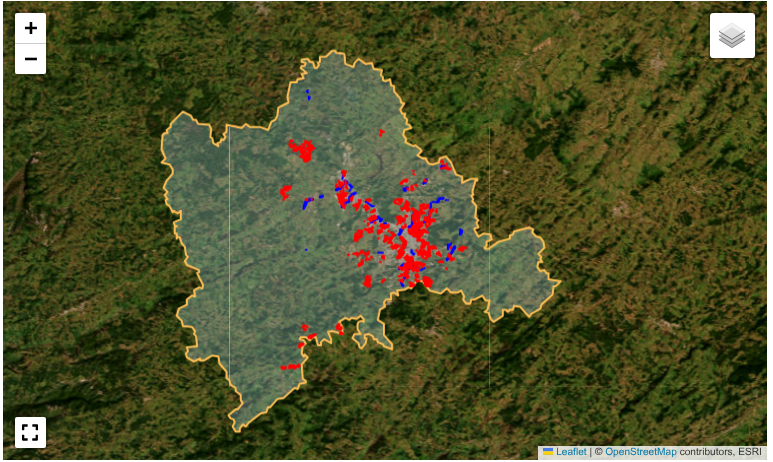
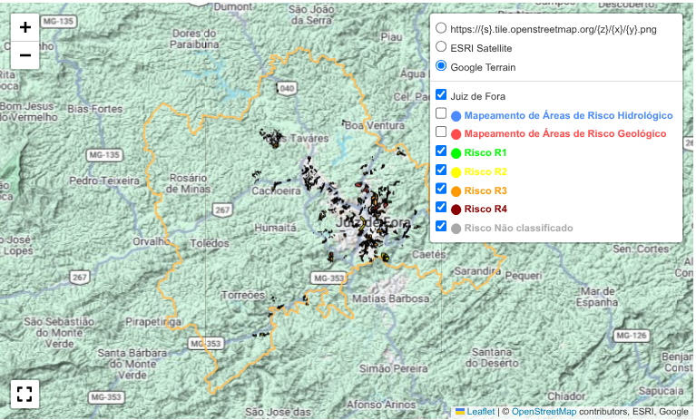

# Mapa de risco de Juiz de Fora

### Introdução

As áreas de risco do município são monitoradas pela **Defesa Civil**. O mapa de risco criado pela *Subsecretaria de Proteção e Defesa Civil*, usando o *Google My Maps*, que orienta o planejamento de ações preventivas e respostas a desastres, está disponível em https://www.pjf.mg.gov.br/subsecretarias/sspdc/mapeamento.php.

Os riscos se enquadram em duas categorias: hidrológico (inundações) e geológico (deslizamentos).<br>

A **Defesa Civil** classifica o risco em uma escala que vai de **R1** (risco muito baixo) a **R4** (risco muito alto).

### Objetivo

Este projeto visa reconstruir o mapa de risco de Juiz de Fora em **Python**, no *Jupyter Lab*, usando *Folium* e outras bibliotecas auxiliares.

### Bibliotecas

Carregamos as seguintes bibliotecas:

- **pandas**: biblioteca fundamental para análise de dados em Python, oferece estruturas como DataFrame e Series para manipulação e análise de dados tabulares;
- **geopandas**: extensão do pandas que facilita o trabalho com dados geoespaciais, permitindo operações geométricas e projeções cartográficas em estruturas de DataFrame;
- **numpy**: pacote essencial para computação científica, fornece suporte a arrays multidimensionais e funções matemáticas de alto desempenho;
- **fiona**: biblioteca para leitura e escrita de dados geoespaciais em diversos formatos, atuando como camada de abstração sobre o OGR;
- **geobr**: pacote brasileiro que disponibiliza acesso simplificado a dados geoespaciais oficiais do Brasil, como malhas municipais, estaduais e federais;
- **folium**: biblioteca para criação de mapas interativos, combinando a facilidade do Python com o poder de visualização do Leaflet.js;
- **Fullscreen (folium.plugins)**: plugin do folium que adiciona funcionalidade de tela cheia aos mapas interativos;
- **os**: módulo da biblioteca padrão que fornece interface para funcionalidades do sistema operacional, como manipulação de arquivos e diretórios;
- **re**: módulo da biblioteca padrão que implementa operações com expressões regulares, permitindo busca, correspondência e manipulação avançada de padrões em strings;
- **zipfile**: módulo da biblioteca padrão para criação, leitura e extração de arquivos ZIP;
- **tqdm**: biblioteca para criação de barras de progresso visualmente atraentes em loops e processos longos;
- **Point (shapely.geometry)**: classe da biblioteca shapely para representação e manipulação de pontos geométricos, fundamental para operações geoespaciais;
- **warnings**: módulo da biblioteca padrão que permite controle sobre mensagens de aviso, aqui utilizado para suprimir alertas durante a execução.


```python
import geopandas as gpd
import pandas as pd
import numpy as np
import fiona
import geobr
import folium
from folium.plugins import Fullscreen
from folium import Element

import os
import re
import zipfile
from tqdm import tqdm

from shapely.geometry import Point
import warnings
warnings.filterwarnings('ignore')
```

### Baixamos o arquivo kml

**KML** (*Keyhole Markup Language*) é um formato de arquivo usado para exibir dados geográficos em um navegador de mapas, que utiliza uma estrutura baseada em tags, baseado no padrão XML, padrão internacional mantido pelo *Open Geospatial Consortium, Inc.* (**OGC**), cujo arquivo de texto é salvo com a extensão *.kml* ou *.kmz*.

Para baixar o arquivo *.kml* que descreve o mapa de risco de Juiz de Fora, acesse o link https://www.pjf.mg.gov.br/subsecretarias/sspdc/mapeamento.php, amplie o mapa disposto no rodapé da página, clique no *menu kebab* (representado por três pontinhos dispostos na vertical) e escolha a opção correspondente.

### Listamos todas as camadas

Listamos as camadas que representam os diferentes tipos de risco levantados pela Defesa Civil.


```python
camadas = fiona.listlayers("mapa_risco_jf.kml")
```

### Criamos o GeoDataFrame

Combinamos todas as camadas em um único *GeoDataFrame*.

Um *GeoDataFrame* é uma estrutura de dados tabular da biblioteca **GeoPandas** (baseada no **Pandas**) que estende os *DataFrames* comuns para armazenar e manipular dados espaciais. Ele obrigatoriamente contém uma coluna especial chamada *geometry*, que armazena as coordenadas geoespaciais e permite operações como cálculo de áreas ou distâncias.


```python
gdfs = []
for layer in camadas:
    gdf = gpd.read_file("mapa_risco_jf.kml", layer=layer)
    # Adicionar coluna identificando a camada de origem
    gdf['camada_origem'] = layer
    gdfs.append(gdf)

# Combinar todos os GeoDataFrames
gdf = pd.concat(gdfs, ignore_index=True)
```

### Inspecionamos o GeoDataFrame


```python
gdf[:5]
```


<div>
<table border="1" class="dataframe">
  <thead>
    <tr style="text-align: right;">
      <th></th>
      <th>Name</th>
      <th>Description</th>
      <th>geometry</th>
      <th>camada_origem</th>
    </tr>
  </thead>
  <tbody>
    <tr>
      <th>0</th>
      <td></td>
      <td>descrição: &lt;br&gt;fid: 1&lt;br&gt;descriptio: descriﾃｧﾃ...</td>
      <td>POLYGON Z ((-43.41704 -21.70866 0, -43.41696 -...</td>
      <td>Mapeamento de Áreas de Risco Hidrológico</td>
    </tr>
    <tr>
      <th>1</th>
      <td></td>
      <td>descrição: &lt;br&gt;fid: 2&lt;br&gt;descriptio: descriﾃｧﾃ...</td>
      <td>POLYGON Z ((-43.4173 -21.7097 0, -43.41753 -21...</td>
      <td>Mapeamento de Áreas de Risco Hidrológico</td>
    </tr>
    <tr>
      <th>2</th>
      <td></td>
      <td>descrição: &lt;br&gt;fid: 3&lt;br&gt;descriptio: descriﾃｧﾃ...</td>
      <td>POLYGON Z ((-43.41907 -21.7118 0, -43.4189 -21...</td>
      <td>Mapeamento de Áreas de Risco Hidrológico</td>
    </tr>
    <tr>
      <th>3</th>
      <td></td>
      <td>descrição: &lt;br&gt;fid: 4&lt;br&gt;descriptio: descriﾃｧﾃ...</td>
      <td>POLYGON Z ((-43.43122 -21.68942 0, -43.43125 -...</td>
      <td>Mapeamento de Áreas de Risco Hidrológico</td>
    </tr>
    <tr>
      <th>4</th>
      <td></td>
      <td>descrição: &lt;br&gt;fid: 5&lt;br&gt;descriptio: descriﾃｧﾃ...</td>
      <td>POLYGON Z ((-43.39063 -21.73177 0, -43.39097 -...</td>
      <td>Mapeamento de Áreas de Risco Hidrológico</td>
    </tr>
  </tbody>
</table>
</div>


```python
gdf.info()
```

    <class 'geopandas.geodataframe.GeoDataFrame'>
    RangeIndex: 1172 entries, 0 to 1171
    Data columns (total 4 columns):
     #   Column         Non-Null Count  Dtype   
    ---  ------         --------------  -----   
     0   Name           1172 non-null   object  
     1   Description    1172 non-null   object  
     2   geometry       1172 non-null   geometry
     3   camada_origem  1172 non-null   object  
    dtypes: geometry(1), object(3)
    memory usage: 36.8+ KB


### Definimos o polígono do município


```python
# Município de Juiz de Fora
jf = geobr.read_municipality(code_muni=3136702, year=2022)
```

### Calculamos o centro do mapa


```python
def safe_centroid(geom):
    try:
        if geom is not None and not geom.is_empty:
            return geom.centroid
    except:
        pass
    return None

# Calcular centroides seguros
centroids = gdf['geometry'].apply(safe_centroid)
valid_centroids = centroids[centroids.notnull()]

if len(valid_centroids) > 0:
    center_lat = np.mean([c.y for c in valid_centroids if c is not None])
    center_lon = np.mean([c.x for c in valid_centroids if c is not None])
else:
    # Fallback: usar bounds
    bounds = gdf_wgs84.total_bounds  # [minx, miny, maxx, maxy]
    center_lat = (bounds[1] + bounds[3]) / 2
    center_lon = (bounds[0] + bounds[2]) / 2
    
```

### Definimos uma função para inicializar o mapa


```python
def initMap():
    tiles = 'OpenStreetMap'
    attr = 'OSM'
    name='OpenStreetMap'

    map = folium.Map(location=[center_lat, center_lon],
                zoom_start = 10,
                tiles = tiles,
                attr = attr)
    return map
```

### Adicionamos a camada ESRI (satélite)


```python
m = initMap()

folium.TileLayer(
    tiles='https://server.arcgisonline.com/ArcGIS/rest/services/World_Imagery/MapServer/tile/{z}/{y}/{x}',
    attr='ESRI',
    name='ESRI Satellite',
    overlay=False
).add_to(m)
```


    <folium.raster_layers.TileLayer at 0x7667783e8380>


### Adicionamos o polígono como uma camada json


```python
jf_geojson = jf.to_crs(epsg=4326).to_json()

folium.GeoJson(
    jf_geojson,
    name='Polígono de Juiz de Fora',  # Nome que aparecerá no controle
    style_function=lambda x: {
        'fillColor': 'lightblue',
        'color': '#FEBF57',
        'weight': 2,
        'fillOpacity': 0.3
    },
    tooltip='Juiz de Fora'
).add_to(m)

```


    <folium.features.GeoJson at 0x766762a80830>


### Definimos o dicionário de cores


```python
cores = {
    'Mapeamento de Áreas de Risco Hidrológico': 'blue',
    'Mapeamento de Áreas de Risco Geológico': 'red'
}
```

### Criamos o grupo de camadas


```python
for camada in gdf['camada_origem'].unique():
    # Filtrar dados da camada
    dados_camada = gdf[gdf['camada_origem'] == camada]
    
    # Criar grupo de camada
    grupo = folium.FeatureGroup(name=camada, show=True)
    
    # Definir cor baseada na camada
    cor = cores.get(camada, 'green')
    
    # Adicionar feições ao grupo
    for idx, row in dados_camada.iterrows():
        if row.geometry.geom_type == 'Polygon' or row.geometry.geom_type == 'MultiPolygon':
            # Para polígonos
            folium.GeoJson(
                row.geometry.__geo_interface__,
                style_function=lambda x, cor=cor: {
                    'fillColor': cor,
                    'color': cor,
                    'weight': 2,
                    'fillOpacity': 0.3
                },
                tooltip=folium.Tooltip(f"Camada: {camada}<br>"
                                       f"Tipo: {row.geometry.geom_type}<br>"
                                       f"ID: {idx}")
            ).add_to(grupo)
        
        elif row.geometry.geom_type == 'LineString' or row.geometry.geom_type == 'MultiLineString':
            # Para linhas
            folium.GeoJson(
                row.geometry.__geo_interface__,
                style_function=lambda x, cor=cor: {
                    'color': cor,
                    'weight': 3,
                    'opacity': 0.8
                },
                tooltip=folium.Tooltip(f"Camada: {camada}<br>"
                                       f"Tipo: {row.geometry.geom_type}<br>"
                                       f"ID: {idx}")
            ).add_to(grupo)
        
        elif row.geometry.geom_type == 'Point' or row.geometry.geom_type == 'MultiPoint':
            # Para pontos
            coords = [row.geometry.y, row.geometry.x]
            folium.CircleMarker(
                coords,
                radius=6,
                color=cor,
                fill=True,
                fillColor=cor,
                fillOpacity=0.7,
                popup=folium.Popup(f"Camada: {camada}<br>"
                                   f"Tipo: {row.geometry.geom_type}<br>"
                                   f"ID: {idx}"),
                tooltip=folium.Tooltip(f"Camada: {camada}")
            ).add_to(grupo)
    
    grupo.add_to(m)
```

### Adicionamos o plugin de tela cheia


```python

fullscreen_plugin = Fullscreen(
    position='bottomleft',
    title='Expandir tela',
    title_cancel='Sair da tela cheia',
    force_separate_button=True
).add_to(m)
```

### Adicionamos controle de camadas


```python
folium.LayerControl(collapse=False).add_to(m)
```


    <folium.map.LayerControl at 0x76676284eed0>


### Exibimos o mapa com as camadas de risco

```python
display(m)
```



### Inspecionamos o campo 'Description'


```python
gdf['Description'][1167]
```


    'fid: 1274<br>descriptio: <br>altitude: <br>Area: 33801<br>Bairro: SAO PEDRO<br>No_edifica: <br>Nome_setor: O_G25_S26<br>Origem_map: <br>Populacao: 4<br>Processo: ESCORREGAMENTO PLANAR<br>Regiao: OESTE<br>Risco: R2<br>Tipologia: GEOLOGICO<br>descrição: <br>layer: <br>path: <br>Vulnerabil: V2<br>Perigo: P1<br>Obs: <br>Origem: SSPDC (2025)<br>Tipo_Area: AD<br>Observacao: <br>Edificacoe: 1'


### Definimos a função para extrair o nível de risco


```python
def extrair_dados_descricao(descricao):
    """
    Extrai múltiplos campos (Bairro, Região, Processo, Risco, Tipologia) da coluna Description
    """
    if pd.isna(descricao) or descricao is None:
        return pd.Series([None, None, None, None, None], 
                        index=['Bairro', 'Regiao', 'Processo', 'Risco', 'Tipologia'])
    
    descricao_str = str(descricao)
    
    # Dicionário com os padrões
    padroes = {
        'Bairro': r'Bairro:\s*([^<]+)',
        'Regiao': r'Regiao:\s*([^<]+)',
        'Processo': r'Processo:\s*([^<]+)',
        'Risco': r'Risco:\s*([Rr][1-4])',
        'Tipologia': r'Tipologia:\s*([^<]+)'
    }
    
    resultados = {}
    for campo, padrao in padroes.items():
        busca = re.search(padrao, descricao_str, re.IGNORECASE)
        if busca:
            valor = busca.group(1).strip()
            # Para Risco, garantir maiúsculo
            if campo == 'Risco':
                valor = valor.upper()
            resultados[campo] = valor
        else:
            resultados[campo] = None
    
    return pd.Series(resultados)

# Aplicar a função e criar todas as colunas de uma vez
gdf[['Bairro', 'Regiao', 'Processo', 'Risco', 'Tipologia']] = gdf['Description'].apply(extrair_dados_descricao)

# Preencher Tipologia vazia com "HIDROLOGICO" baseado no processo
mask_hidrologico = (gdf['Tipologia'] == '') & (gdf['Processo'].str.contains('INUNDACAO|ALAGAMENTO', case=False, na=False))
gdf.loc[mask_hidrologico, 'Tipologia'] = 'HIDROLOGICO'

```

### Inspecionamos o GeoDataFrame modificado


```python
gdf[:5]
```


<div>
<table border="1" class="dataframe">
  <thead>
    <tr style="text-align: right;">
      <th></th>
      <th>Name</th>
      <th>Description</th>
      <th>geometry</th>
      <th>camada_origem</th>
      <th>Bairro</th>
      <th>Regiao</th>
      <th>Processo</th>
      <th>Risco</th>
      <th>Tipologia</th>
    </tr>
  </thead>
  <tbody>
    <tr>
      <th>0</th>
      <td></td>
      <td>descrição: &lt;br&gt;fid: 1&lt;br&gt;descriptio: descriﾃｧﾃ...</td>
      <td>POLYGON Z ((-43.41704 -21.70866 0, -43.41696 -...</td>
      <td>Mapeamento de Áreas de Risco Hidrológico</td>
      <td>SANTA AMELIA</td>
      <td>NORTE</td>
      <td>INUNDACAO</td>
      <td>R1</td>
      <td>HIDROLOGICO</td>
    </tr>
    <tr>
      <th>1</th>
      <td></td>
      <td>descrição: &lt;br&gt;fid: 2&lt;br&gt;descriptio: descriﾃｧﾃ...</td>
      <td>POLYGON Z ((-43.4173 -21.7097 0, -43.41753 -21...</td>
      <td>Mapeamento de Áreas de Risco Hidrológico</td>
      <td>VILA SAO SEBASTIAO</td>
      <td>NORTE</td>
      <td>INUNDACAO</td>
      <td>R2</td>
      <td>HIDROLOGICO</td>
    </tr>
    <tr>
      <th>2</th>
      <td></td>
      <td>descrição: &lt;br&gt;fid: 3&lt;br&gt;descriptio: descriﾃｧﾃ...</td>
      <td>POLYGON Z ((-43.41907 -21.7118 0, -43.4189 -21...</td>
      <td>Mapeamento de Áreas de Risco Hidrológico</td>
      <td>VILA SAO SEBASTIAO</td>
      <td>NORTE</td>
      <td>INUNDACAO</td>
      <td>R1</td>
      <td>HIDROLOGICO</td>
    </tr>
    <tr>
      <th>3</th>
      <td></td>
      <td>descrição: &lt;br&gt;fid: 4&lt;br&gt;descriptio: descriﾃｧﾃ...</td>
      <td>POLYGON Z ((-43.43122 -21.68942 0, -43.43125 -...</td>
      <td>Mapeamento de Áreas de Risco Hidrológico</td>
      <td>ARAUJO</td>
      <td>NORTE</td>
      <td>ALAGAMENTO</td>
      <td>R2</td>
      <td>HIDROLOGICO</td>
    </tr>
    <tr>
      <th>4</th>
      <td></td>
      <td>descrição: &lt;br&gt;fid: 5&lt;br&gt;descriptio: descriﾃｧﾃ...</td>
      <td>POLYGON Z ((-43.39063 -21.73177 0, -43.39097 -...</td>
      <td>Mapeamento de Áreas de Risco Hidrológico</td>
      <td>INDUSTRIAL</td>
      <td>CENTRO-OESTE</td>
      <td>ALAGAMENTO</td>
      <td>R2</td>
      <td>HIDROLOGICO</td>
    </tr>
  </tbody>
</table>
</div>


### Exibimos o mapa com os níveis de risco


```python
m = initMap()

folium.TileLayer(
    tiles='https://server.arcgisonline.com/ArcGIS/rest/services/World_Imagery/MapServer/tile/{z}/{y}/{x}',
    attr='ESRI',
    name='ESRI Satellite',
    overlay=False
).add_to(m)

folium.TileLayer(
    tiles = 'https://mt1.google.com/vt/lyrs=p&x={x}&y={y}&z={z}',
    attr = 'Google',
    name = 'Google Terrain',
    overlay = False
).add_to(m)

folium.GeoJson(
    jf_geojson,
    name='Juiz de Fora',
    style_function=lambda x: {
        'fillColor': 'transparent',
        'color': '#FEBF57',
        'weight': 2,
        'fillOpacity': 0.3
    },
    tooltip='Município de Juiz de Fora'
).add_to(m)


cores_risco = {
    'R1': '#00ff00',  # Verde (menor risco)
    'R2': '#ffff00',  # Amarelo
    'R3': '#ff9900',  # Laranja
    'R4': '#8b0000',  # Vermelho escuro (maior risco)
    'Não classificado': '#A9A9A9',  # Cinza para não classificado
    'Mapeamento de Áreas de Risco Hidrológico': '#4B8BFF',  # Azul (para camada original)
    'Mapeamento de Áreas de Risco Geológico': '#FF4B4B'   # Vermelho (para camada original)
}

# Primeiro, manter as camadas originais por tipo de risco
for camada in gdf['camada_origem'].unique():
    dados_camada = gdf[gdf['camada_origem'] == camada]
    
    # Extrair o tipo de risco usando regex
    if 'Hidrológico' in camada:
        nome_curto = 'Risco Hidrológico'
    elif 'Geológico' in camada:
        nome_curto = 'Risco Geológico'
    else:
        nome_curto = camada  # fallback para outros casos
    
    # Adicionar cor no nome da camada usando HTML
    cor = cores_risco.get(camada, 'green')
    nome_camada = f'<span style="color:{cor}; font-weight:bold;">⬤ {nome_curto}</span>'
    grupo = folium.FeatureGroup(name=nome_camada, show=False)
    
    for idx, row in dados_camada.iterrows():
        if row.geometry.geom_type in ['Polygon', 'MultiPolygon']:
            folium.GeoJson(
                row.geometry.__geo_interface__,
                style_function=lambda x, cor=cor: {
                    'fillColor': cor,
                    'color': cor,
                    'weight': 2,
                    'fillOpacity': 0.3
                },
                tooltip=folium.Tooltip(f"Camada: {camada}<br>Tipo: {row.geometry.geom_type}")
            ).add_to(grupo)
    grupo.add_to(m)

# Criar FeatureGroups para cada nível de risco com cores nos nomes
grupos_risco = {}
for nivel in ['R1', 'R2', 'R3', 'R4', 'Não classificado']:
    cor = cores_risco.get(nivel, '#A9A9A9')
    # Adicionar cor no nome do nível de risco usando HTML
    nome_nivel = f'<span style="color:{cor}; font-weight:bold;">⬤ {nivel}</span>'
    grupos_risco[nivel] = folium.FeatureGroup(name=nome_nivel, show=True)

# Adicionar feições aos grupos correspondentes
for idx, row in gdf.iterrows():
    nivel = row.get('Risco', 'Não classificado')
    if nivel not in grupos_risco:
        nivel = 'Não classificado'
    
    cor = cores_risco.get(nivel, '#A9A9A9')
    grupo = grupos_risco[nivel]
    
    # Criar tooltip apenas com as informações solicitadas
    tooltip_text = f"""
    <div style='font-family: Arial; font-size: 12px;'>
        <b>Nível de Risco:</b> {nivel}<br>
        <b>Bairro:</b> {row.get('Bairro', 'N/A')}<br>
        <b>Região:</b> {row.get('Regiao', 'N/A')}<br>
        <b>Processo:</b> {row.get('Processo', 'N/A')}<br>
        <b>Tipologia:</b> {row.get('Tipologia', 'N/A')}
    </div>
    """
    
    if row.geometry.geom_type in ['Polygon', 'MultiPolygon']:
        folium.GeoJson(
            row.geometry.__geo_interface__,
            style_function=lambda x, cor=cor: {
                'fillColor': cor,
                'color': 'black' if nivel != 'Não classificado' else cor,
                'weight': 1,
                'fillOpacity': 0.7 if nivel != 'Não classificado' else 0.3
            },
            tooltip=folium.Tooltip(tooltip_text),
            popup=folium.Popup(f"Risco: {nivel}")
        ).add_to(grupo)

# Adicionar todos os grupos ao mapa
for grupo in grupos_risco.values():
    grupo.add_to(m)

# Plugin de tela cheia
Fullscreen(
    position='bottomleft',
    title='Expandir tela',
    title_cancel='Sair da tela cheia',
    force_separate_button=True
).add_to(m)


# Controle de camadas (agora com mais opções)
folium.LayerControl(collapsed=False, position='topright').add_to(m)
                                                                                                    
display(m)

# Salvar mapa (opcional)
# m.save('mapa_risco_com_jf.html')
# print("\n Mapa salvo como 'mapa_risco_jf.html'")
```



**Considerações finais:**

Reconstruimos o mapa de risco de Juiz de Fora, a partir do arquivo *.kml*, com o auxílio de diversas bibliotecas do Python, para assegurar controle das características,  visualização por camadas e seleção de texturas.

Veja o mapa interativo em: https://guiajf.github.io/riscojf/.

**Fontes:**

https://www.pjf.mg.gov.br/subsecretarias/sspdc/mapeamento.php


**Referências:**

*Plano de Contingência Municipal - para respostas aos desastres ocasionados pelas chuvas - período chuvoso 2025-2026*. Elaborado pela Subsecretaria de Proteção e Defesa Civil. Juizde Fora, Outubro de 2025. Disponível em: https://www.pjf.mg.gov.br/subsecretarias/sspdc/arquivos/periodo_chuvoso_2025_2026.pdf.


